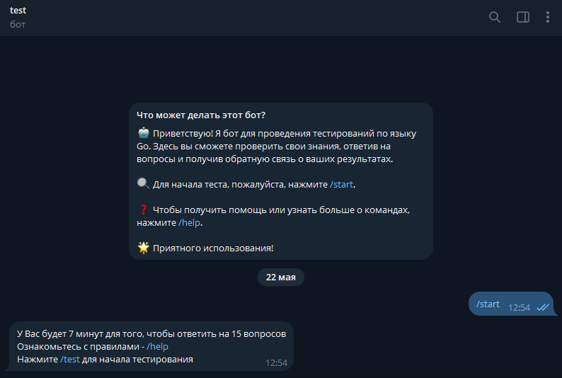
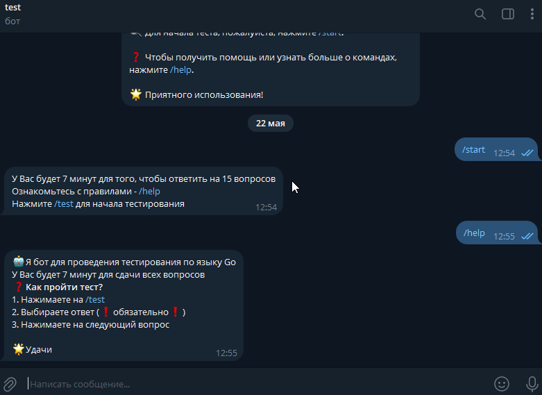
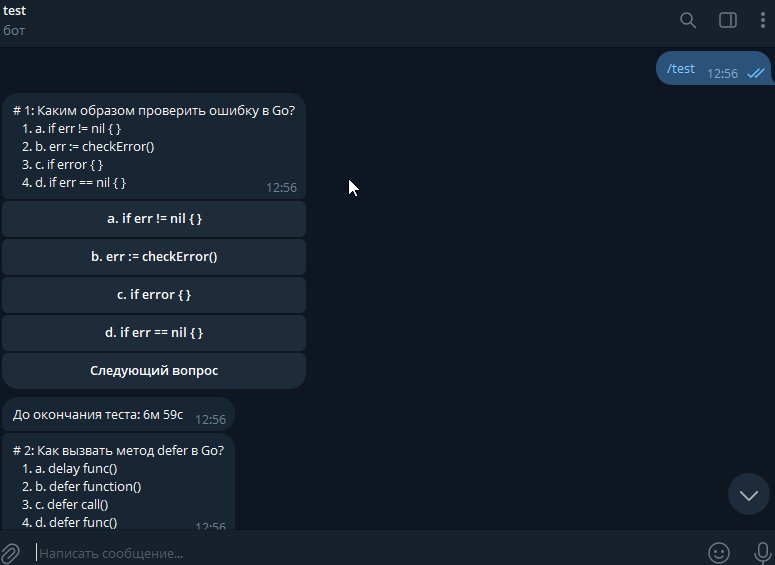
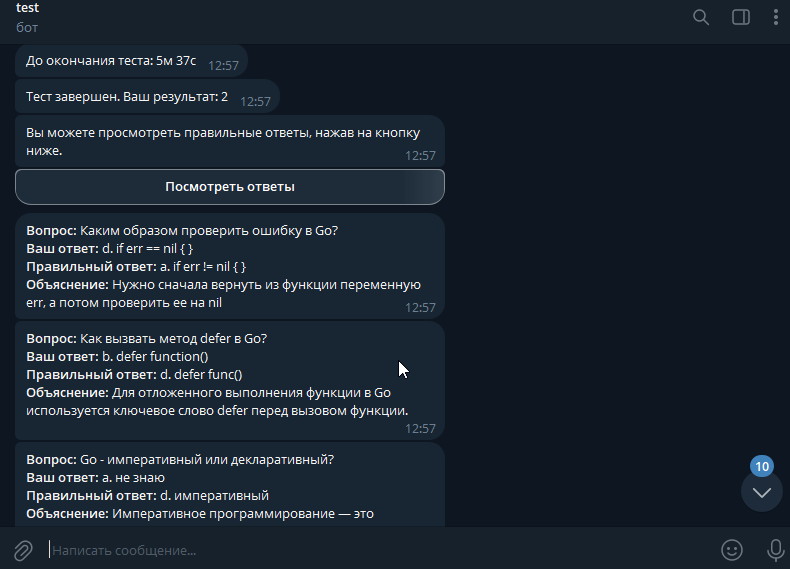

# go-interview-bot

This project is a Telegram bot that allows users to take an interview by answering several questions within a limited time. At the end of the test, the bot shows the results and indicates incorrect answers.

## Contents

- [Requirements](#requirements)
- [Installation](#installation)
- [Configuration](#configuration)
- [Running](#running)
- [Usage](#usage)
- [Examples](#examples)
- [Features to implement](#features)
- [Contribution](#contribution)
- [License](#license)
- [Contact](#contact)

## Requirements

- Go 1.16 or higher
- Docker
- Registered bot on Telegram and obtained API token
- PostgreSQL database

## Installation

1. Clone the repository:

    ```bash
    git clone https://github.com/username/go-interview-bot.git
    cd go-interview-bot
    ```

2. Install the necessary dependencies:

    ```bash
    go mod tidy
    ```

## Configuration

1. Create a `config.yml` file in the `config` folder and add your settings:

    ```yaml
    port: db_port      
    host: db  # a service name for the PostgreSQL container
    user: db_user     
    password: db_password 
    database: db_name   
    bot_token: your_bot_token_from_botfather
    ```

2. Create and initialize the PostgreSQL database if it's not already created.

## Running

1. Compile and run the project:

    ```bash
    go run cmd/bot/main.go
    ```

2. Alternatively, build the executable file and run it:

    ```bash
    go build -o go-interview-bot cmd/bot/main.go
    ./go-interview-bot
    ```

3. To run using Docker, execute the following commands:

    ```bash
    docker-compose up
    ```

## Usage

Once started, the bot will be online and ready for interaction. You can send the `/test` command to start the interview.

### Example Commands

- `/start` - Welcome message
- `/help` - Help message
- `/test` - Start the interview

## Examples

### Starting the Bot

Send the `/start` command to receive a welcome message from the bot.



### Viewing Help

Send the `/help` command to receive a help message from the bot.



### Taking the Test

Send the `/test` command to begin the interview. Answer the questions within the given time limit.



### Viewing Results

After completing the test, the bot will display your results and indicate any incorrect answers.



## Features

[x] Code questions
[ ] Grade system and questions
[ ] Question difficulty lvl
[ ] Multi-answers

## Contribution

If you would like to contribute to the project, please follow these steps:

1. Fork the repository
2. Create a branch for your feature (`git checkout -b feature/AmazingFeature`)
3. Commit your changes (`git commit -m 'Add some AmazingFeature'`)
4. Push your branch (`git push origin feature/AmazingFeature`)
5. Create a Pull Request

## License

This project is licensed under the MIT License. See the [LICENSE](LICENSE) file for details.

## Contact

If you have any questions or suggestions about the project, feel free to contact me at [@zakEther](https://t.me/zakEther).
